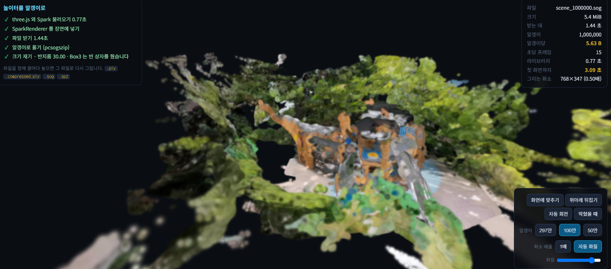

# 고른 공간

폰으로 찍은 영상 하나에서 3차원 장면을 만들어 웹에 올린 것입니다.
사진 24장을 3차원 점 296만 개로 풀고, 그 점을 가우시안 알갱이로 바꿔 `.sog` 로 줄였습니다.

## 주소

https://nike1137-svg.github.io/my-open-space/

기본값인 알갱이 100만 개짜리입니다. 왼쪽 위 다섯 걸음이 전부 통과했고,
오른쪽 위에 판정에 쓰는 숫자가 찍힙니다. `Box3 는 빈 상자를 줬습니다` 는
고장이 아니라 예상된 결과입니다 — 알갱이 덩어리는 일반 메시가 아니라서
three.js 의 기본 자로는 크기를 못 잽니다.

## 어디를 골랐나

- 아파트 단지 안 야외 놀이터에 있는 **배 모양 조합놀이대**입니다. 둘레를 한 바퀴 돌 수
  있어서 시차가 크게 쌓이고, 나무 널판·파란 세로살·닻 무늬·바닥 자갈로 잡을 무늬가 많습니다.
- 공개해도 되는 곳이라고 판단한 근거
  - 제가 사는 단지가 아니고, 촬영을 제한하는 안내는 없었습니다.
  - 프레임 24장을 전부 확인해 **사람 0명, 얼굴 없음, 차량 번호판 없음**입니다.
  - 배경에 아파트 현관 동 번호가 찍혔지만, 모델이 실제로 받은 입력 해상도가
    518×294 라서 원본에서 23픽셀이던 그 숫자가 **6픽셀로 뭉개집니다.**
    알갱이 색은 그 축소된 그림에서 왔으므로 게시된 `.sog` 에는 글자가 남지 않습니다.
  - 올리는 파일은 `index.html` 과 `scene.sog` 둘뿐이고, 원본 사진은 올리지 않았습니다.

## 어떻게 찍었나

- 길이 **33.6초**, 1080p(1920×1080) 가로, 뽑은 장수 **24장**
  - 고정 fps 를 쓰지 않고 `fps = 24 / 33.6 = 0.714` 로 계산해 길이와 무관하게 24장이 되게 했습니다.
    고정값을 썼다면 54장이 뽑혀 T4 메모리에 부담이 됐을 것입니다.
  - 번짐 검사: 라플라시안 분산 중앙값 377, 최저 166 — 번진 장 0개
- 카메라가 퍼진 정도 **0.5454** (0.1이 기준선)
  - 카메라 퍼짐 32.73 / 장면 대각선 60.01. 구조물 둘레를 돌아서 방을 훑을 때보다 큽니다.
- 나온 점 **296만 개** (복원 직후 3,042,965 → 멀리 튄 점 버린 뒤 2,965,259)
  - 각 축 0.5~99.5 백분위 밖을 버렸습니다. 버린 것은 2.6%인데 장면 대각선이
    165 → 60으로 2.8배 줄었습니다. 야외라 하늘과 먼 배경이 무한대 쪽으로 날아가 있었습니다.

복원은 코랩 T4(계산 능력 7.5)에서 `facebook/map-anything-apache` 로 했습니다.
그 카드에는 bf16 이 없어 `amp_dtype="fp16"` 을 지정했고, 최대 GPU 메모리 6.74GB,
복원 시간 10.0초였습니다. bf16 을 그대로 두면 32비트로 풀려 메모리가 넘칩니다.

## 형식별로 잰 값

| 형식 | 파일 크기 | 알갱이 개수 | 알갱이당 바이트 | 변환 시간 |
|---|---|---|---|---|
| `.ply` | 201,638,029 (192.3 MiB) | 2,965,259 | **68.00** | 1.7초 |
| `.compressed.ply` | 48,278,853 (46.0 MiB) | 2,965,259 | **16.28** | 25.6초 |
| `.spz` | 26,098,217 (24.9 MiB) | 2,965,259 | **8.80** | 18.5초 |
| `.sog` | 15,106,087 (14.4 MiB) | 2,965,259 | **5.09** | 25.9초 |

- 개수는 도구가 찍은 반올림값을 믿지 않고 파일에서 직접 셌습니다.
  `.ply`/`.compressed.ply` 는 PLY 헤더의 `element vertex`, `.sog` 는 zip 안
  `meta.json` 의 `count`, `.spz` 는 머리 16바이트의 `numPoints` 입니다. **넷 다 같습니다** —
  형식만 바뀌었고 점을 솎아 낸 것이 아닙니다.
- `.ply` 를 알갱이 개수로 나눈 값이 **68** 인 것은 각도별 색(`f_rest_0`~`f_rest_44`) 45칸을
  헤더에 아예 넣지 않았다는 뜻입니다. 재서 채운 파일이라 그것이 정상이고,
  0으로 채워 적었다면 244바이트·724MB가 됐을 것입니다.
- `.ply` 는 192.3 MiB 라 깃허브 한 파일 한계 100 MiB 를 넘습니다. 줄이는 것은
  취향이 아니라 지나가야 하는 걸음이었습니다.
- **`.spz` 는 이 조합에서 화면에 안 올라갑니다.** `splat-transform` 3.2.0 이 쓴 것을
  `Spark` 2.1.0 이 `Unsupported SPZ version: 4` 로 거부합니다. 게시에는 `.sog` 를 썼습니다.

## 폰에서 첫 화면까지

갤럭시, 카카오톡 인앱 브라우저, Wi-Fi 에서 잰 값입니다. 링크를 받은 사람이
실제로 쓰는 통로라 이 조건으로 쟀습니다.

**내 폰 2.57초.** 남의 폰은 아직 못 재 봤습니다.

갤럭시 노트20, 시크릿 창(캐시 없음)으로 처음 열어 잰 값입니다.
기본값인 100만 개짜리 기준입니다.

| 걸음 | 시간 | 누적 |
|---|---|---|
| 라이브러리(CDN)에서 three.js·Spark 받기 | 0.74초 | 0.74초 |
| `scene_1000000.sog` 5.4 MiB 받기 | 0.58초 | 1.32초 |
| 알갱이 100만 개를 풀어 GPU 에 올리기 | 1.25초 | **2.57초** |

**시간이 제일 많이 든 곳은 파일 받기가 아니라 알갱이를 푸는 일입니다.**
초당 80만 개꼴입니다. 파일을 더 줄여도 이 1.25초는 안 줄어듭니다.
줄이려면 알갱이 개수를 줄여야 합니다.

### 처음 잰 2.58초는 버렸습니다

같은 자리에서 2.58초가 나왔는데, 쪼개 보니 라이브러리 0.62초 + 파일 받기 1.87초
= 2.49초여서 **알갱이 297만 개를 푸는 데 0.09초** 걸렸다는 뜻이 됐습니다.
초당 3,290만 개라 있을 수 없는 값입니다.

원인은 `SplatMesh` 를 만든 직후에 변수에 넣은 것이었습니다. 그 객체는
`await initialized` 가 끝나기 전에는 아직 화면에 안 올라간 상태인데, 그리기 고리가
변수가 비었는지만 보고 프레임을 세니 실제보다 이른 시각이 찍혔습니다.
준비가 끝난 뒤에 넣도록 고치고 다시 쟀습니다.

고친 뒤 초당 80만 개는 말이 되는 값이라, 이번 2.57초는 믿을 만합니다.

### 초당 프레임

| 알갱이 | 파일 크기 | 받는 데 | 초당 프레임 |
|---|---|---|---|
| 2,965,259 | 14.4 MiB | 1.20초 | **11** |
| 1,000,000 | 5.4 MiB | 0.58초 | **31** |
| 500,000 | 2.8 MiB | 0.03초 (캐시) | **21** |

**이 표를 그대로 읽으면 안 됩니다.** 50만 개가 100만 개보다 느리게 나왔는데, 개수가
적은 쪽이 느릴 수는 없습니다. 화면을 손가락으로 당겨 놓은 정도가 서로 달랐기
때문입니다. 알갱이가 화면을 가득 덮으면 겹쳐 바르는 양이 그만큼 늘어서, 같은 개수라도
가까이서 보면 느려집니다. **프레임률은 개수만의 함수가 아니라 화면을 얼마나 덮는지의
함수**이기도 합니다. 견주려면 시야를 똑같이 맞춰 놓고 재야 합니다.

시야를 비슷하게 두고 잰 첫 회차에서는 297만 12 / 100만 37 / 50만 46 이 나왔고,
그때는 297만 → 100만에서 개수가 2.97배 줄고 프레임이 3.08배 빨라져 거의
정비례했습니다.

어느 회차로 보든 **297만 개는 10~12 로 끊기고 100만 개는 30 이상**입니다.
그래서 기본값을 100만 개로 두었습니다. 297만 개는 화면 아래 버튼으로 바꿔 볼 수 있습니다.

`받는 데 0.03초` 는 회선으로 환산하면 780 Mbps 라 있을 수 없는 값입니다.
버튼으로 한 번 불러온 뒤라 캐시에서 꺼낸 것입니다. 처음 받는 시간이 아닙니다.

`첫 화면까지` 는 파일을 바꿔도 2.57초로 그대로 있습니다. 페이지를 열고 처음 화면이
뜰 때까지를 한 번만 재고 붙잡아 두기 때문입니다. 버튼을 눌러 바뀐 값이 아닙니다.

## 노트북이 폰보다 느렸습니다

외장 그래픽 장치가 없는 노트북, Chrome 시크릿 창에서 같은 주소를 열어 쟀습니다.

| 알갱이 | 노트북 | 폰 |
|---|---|---|
| 2,965,259 | 4 | 11 |
| 1,000,000 | 7 | 31 |
| 500,000 | 13 | 21 |

**알갱이 개수 탓이 아닙니다.** 노트북에서 297만 → 100만으로 개수를 2.97배 덜었는데
프레임은 1.75배만 빨라졌습니다. 개수가 병목이면 3배 가까이 빨라졌어야 합니다.

원인은 그릴 화소였습니다. 노트북 창은 1536×694 이고 폰은 화소 배율 1배에서
412×800 쯤이라, 노트북이 **1.6배 많은 화소**를 그리면서 장치는 더 약했습니다.

### 그래서 그리는 화소를 스스로 줄이게 했습니다

프레임이 24 아래면 그리는 버퍼를 0.85배씩 낮추고, 50 위면 되돌립니다. 사이를 비워
두어 두 값 사이에서 왔다 갔다 하지 않습니다. 화면은 CSS 가 늘려 채우므로 조금
부드러워질 뿐입니다.

| | 그리는 화소 | 초당 프레임 |
|---|---|---|
| 자동 화질 끄고 | 1536×694 (1.00배) | 7 |
| 자동 화질 켜고 | **768×347 (0.50배)** | **12~18** |

첫 화면까지도 1.95초로 줄었습니다 (라이브러리 0.52 + 파일 받기 0.54 + 알갱이 풀기 0.89).

**여기서 알게 된 것이 하나 더 있습니다.** 낮춘 뒤 노트북이 그리는 화소는 266,496 개로
폰의 329,600 개보다 오히려 적은데도 프레임은 18 대 31 로 여전히 느립니다. 화소 수만의
문제가 아니라 **이 노트북의 내장 그래픽이 폰보다 이 일에 약하다**는 뜻입니다.
남이 어떤 기계로 열지 모르니, 개수를 하나로 못 박는 대신 스스로 맞추게 둔 판단이
여기서 값을 합니다.

스톱워치를 쓰지 않습니다. 페이지가 스스로 재서 오른쪽 위에 찍습니다.

| 화면에 찍히는 값 | 무엇을 재나 |
|---|---|
| 라이브러리 | CDN 에서 three.js 와 Spark 를 받은 시각 |
| 받는 데 | `.sog` 파일만 받은 시간 |
| **첫 화면까지** | 페이지를 열기 시작한 순간부터 알갱이가 화면에 찍히기까지 (총합) |
| 초당 프레임 | 뜬 뒤의 부드러움 |

`performance.now()` 가 페이지를 열기 시작한 순간부터의 밀리초라서, 그 값을
그대로 쓰면 폰에서도 초시계 없이 총 시간이 나옵니다. 두 번째 방문부터는 캐시가
걸려 빨라지므로 **첫 측정이 진짜 값**입니다.

회선별로 파일 받는 시간만 계산하면 `.sog` 15.1MB 기준 10Mbps 12.1초, 50Mbps 2.4초,
100Mbps 1.2초입니다. `.ply` 였다면 10Mbps 에서 161초였습니다.

## 크기와 부드러움은 다른 축입니다

`.ply` 201.6MB 를 `.sog` 15.1MB 로 줄여 **기다리는 시간은 13.3배** 줄었지만,
알갱이 개수는 2,965,259 개 그대로라 **뜬 뒤의 부담은 안 줄었습니다.** 형식을 바꾸는 것은
같은 알갱이를 어떻게 적어 두느냐를 바꾸는 일이지 알갱이를 덜어 내는 일이 아닙니다.

그래서 알갱이 축을 손댈 수단을 페이지에 붙였습니다.

| 손잡이 | 무엇이 바뀌나 |
|---|---|
| 알갱이 297만 / 100만 / 50만 | 다른 파일을 물어옵니다. 개수를 줄일 때 K 를 1.4 → 2.0 으로 올려 반지름이 √N 에 반비례해 커지게 만들었습니다 |
| 화소 배율 1배 / 2배 | 2배면 그릴 화소가 네 배입니다. 기본은 1배 |
| 퍼짐 | 알갱이가 덮는 넓이를 줄여 겹쳐 바르는 양을 줄입니다 |

| 파일 | 알갱이 | 크기 | 반지름 |
|---|---|---|---|
| `scene.sog` | 2,965,259 | 14.4 MiB | 3.5 cm |
| `scene_1000000.sog` | 1,000,000 | 5.4 MiB | 8.6 cm |
| `scene_500000.sog` | 500,000 | 2.8 MiB | 12.2 cm |

## 안 나온 자리

- **카메라 경로가 닫히지 않은 호**입니다. 구조물을 거의 한 바퀴 돌았지만 끝이 열려 있어,
  그 열린 쪽에서 보이는 면은 사진이 한 장도 없습니다. 참고할 화소가 없으니 검게 남습니다.
  되찾는 일이 아니라 지어내는 일이 되는 자리라 이 파이프라인으로는 채울 수 없습니다.
- **나뭇잎**은 장마다 모양이 달라져 두 사진에서 같은 지점을 알아볼 수 없습니다.
  나무 쪽에 지저분한 점이 낍니다.
- **하늘과 먼 배경**은 역깊이가 0에 눌어붙어 거리로 되돌리면 무한대 쪽으로 날아갑니다.
  백분위로 잘라내 버렸고, 그래서 하늘 자리도 비어 있습니다.
- **각도를 틀어도 색이 변하지 않습니다.** 각도별 색 45칸이 비어 있어서입니다.
  광택이나 반사가 각도에 따라 달라지지 않는 것은 고장이 아니라 이 파일이 원래 그렇습니다.

## 쓴 것들

| | 라이선스 |
|---|---|
| MapAnything (`-apache` 판 가중치) | Apache-2.0 |
| three.js | MIT |
| Spark | MIT |
| splat-transform | MIT |

알갱이 `.ply` 는 INRIA 형식 명세에 맞춰 numpy 로 직접 썼습니다. 원본 3DGS 구현
코드(연구·평가 목적 한정)는 쓰지 않았습니다.
